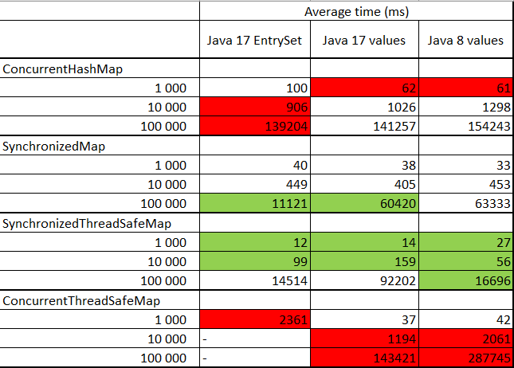

# java-mentoring-program-module-7


## Task 1

Performance comparison:


ConcurrentThreadSafeMap the slowest solution due to making a copy of entry set or values to CopyOnWriteArrayList(Set). With using EntrySet were not able to test on 10 000 and 100 000 iterations, because on each retrieving EntrySet element-by-element copying takes place. When approach was changed to retrieving values instead of EntrySet the solution become much faster, since it does not copy the array element by element, but puts it in a wrapper.

Because we are using only two threads seems like synchronized approach is better than all another. In high loaded systems with multiple threads execution I suppose concurrent solution will work faster.

### Questions:

- What has happened after simple Map implementation exchanging? 

When we are using synchronized map we get ConcurrentModificationException due the iterator is not synchronized, we should modify code in loop:

```
synchronized (numbers) {
    for (Integer value : numbers.values()) {
        sum += value;
    }
}
```
- Different versions

Java 17 shows better performance than 8 due to optimization in concurrent package

